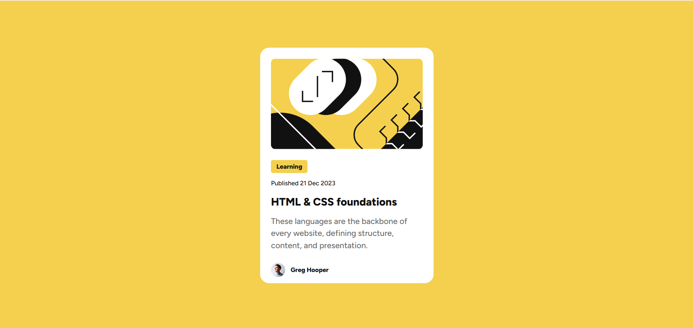

# Frontend Mentor - Blog preview card solution

This is a solution to the [Blog preview card challenge on Frontend Mentor](https://www.frontendmentor.io/challenges/blog-preview-card-ckPaj01IcS). Frontend Mentor challenges help you improve your coding skills by building realistic projects. 

## Table of contents

- [Overview](#overview)
  - [The challenge](#the-challenge)
  - [Screenshot](#screenshot)
  - [Links](#links)
- [My process](#my-process)
  - [Built with](#built-with)
  - [What I learned](#what-i-learned)
  - [Continued development](#continued-development)
  - [Useful resources](#useful-resources)

## Overview

### The challenge

Users should be able to:

- See hover and focus states for all interactive elements on the page

### Screenshot

### Links

- Solution URL: [The link to the solution in GitHub](https://github.com/SaiDineshKopparthi/Frontend-Mentor-Challanges/tree/main/blog-preview-card)
- Live Site URL: [The live link to deployed site](https://blog-preview-card-dinesh.netlify.app/)

## My process

### Built with

- Semantic HTML5 markup
- CSS custom properties
- Flexbox
- CSS Grid

### What I learned

In this project, I learned how to implement a responsive design approach, making sure the layout is responsive across different screen sizes. I also explored the use of CSS custom properties to manage colors and styles efficiently, reducing repetition in my code. Flexbox helped me create a flexible layout that adapts well to different screen sizes. Additionally, I gained experience with hover, active, and focus states to improve interactivity and user experience on the site.

### Continued development

In future projects, I want to continue improving my understanding of CSS Grid and how it can be used alongside Flexbox for even more complex layouts. I'll also focus on refining my use of CSS custom properties for better maintainability and scalability of styles. I’d like to get more comfortable with media queries and learn how to create more dynamic, adaptive designs for different screen sizes.

### Useful resources

- [A link to W3 HTML](https://www.w3schools.com/html/) - This resource provided the foundational knowledge needed to structure the project using HTML.
- [A link to W3 CSS](https://www.w3schools.com/css/default.asp) - Helped me understand CSS basics, including styling, layout techniques, and essential properties like margin, padding, and Flexbox.