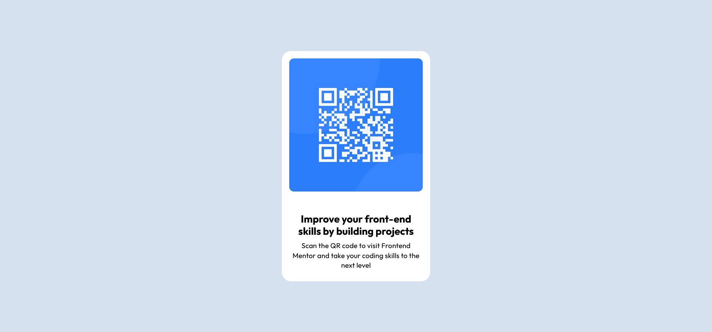

# Frontend Mentor - QR code component solution

This is a solution to the [QR code component challenge on Frontend Mentor](https://www.frontendmentor.io/challenges/qr-code-component-iux_sIO_H). Frontend Mentor challenges help you improve your coding skills by building realistic projects. 

## Table of contents

- [Overview](#overview)
  - [Screenshot](#screenshot)
  - [Links](#links)
- [My process](#my-process)
  - [Built with](#built-with)
  - [What I learned](#what-i-learned)
  - [Continued development](#continued-development)
  - [Useful resources](#useful-resources)
- [Author](#author)
- [Acknowledgments](#acknowledgments)

**Note: Delete this note and update the table of contents based on what sections you keep.**

## Overview

### Screenshot

### Links

- Solution URL: [Git Repository](https://github.com/SaiDineshKopparthi/Frontend-Mentor-Challanges/tree/main/qr-code-component)
- Live Site URL: [Host URL](https://qr-code-component-dinesh.netlify.app/)

## My process

### Built with

- SHTML5
- CSS
- Flexbox (CSS Layout Tool)
- Google Fonts

### What I learned
This project helped me deepen my understanding of **CSS Flexbox**. Although it's a simple project, as a backend developer who initially lacked much interest in frontend development, I found myself lost when trying to implement even basic designs. However, after some effort and exploration, I gained clarity on the properties and behavior of **Flexbox**. This understanding has motivated me to continue expanding my knowledge of frontend development.

### Continued development
I want to continue exploring the properties of CSS Grid to understand its potential for creating more advanced layouts. Additionally, I aim to deepen my knowledge of fundamental concepts like margin, padding, and other box model properties to refine my designs. While responsive design wasn't a necessity for this project, I am eager to learn more about it to ensure my future projects are adaptable to different screen sizes and devices.

### Useful resources

- [W3 HTML](https://www.w3schools.com/html/) - This resource provided the foundational knowledge needed to structure the project using HTML.
- [W3 CSS](https://www.w3schools.com/css/default.asp) - Helped me understand CSS basics, including styling, layout techniques, and essential properties like margin, padding, and Flexbox.
