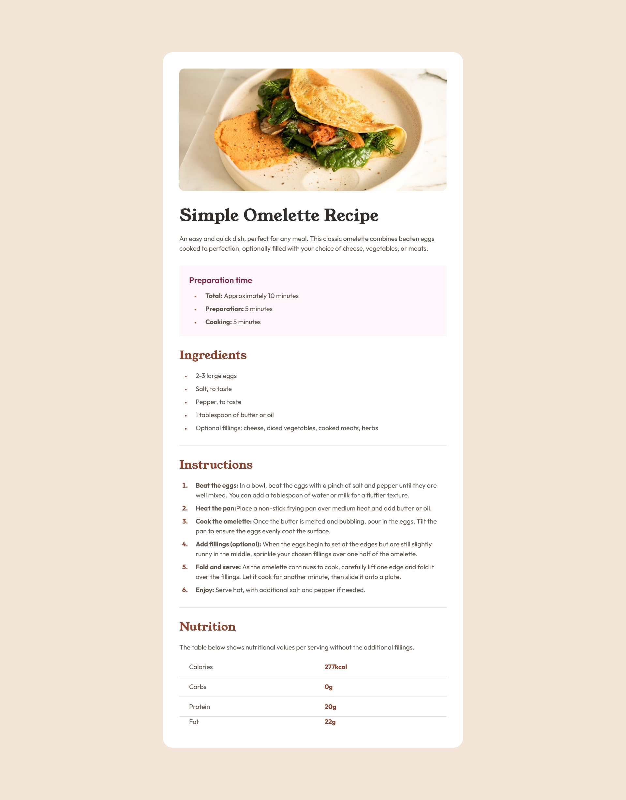

# Frontend Mentor - Recipe page solution

This is a solution to the [Recipe page challenge on Frontend Mentor](https://www.frontendmentor.io/challenges/recipe-page-KiTsR8QQKm). Frontend Mentor challenges help you improve your coding skills by building realistic projects.

## Table of contents

- [Overview](#overview)
  - [Screenshot](#screenshot)
  - [Links](#links)
- [My process](#my-process)
  - [Built with](#built-with)
  - [What I learned](#what-i-learned)
  - [Continued development](#continued-development)
  - [Useful resources](#useful-resources)

## Overview

### Screenshot

### Links

- Solution URL: [Link to the solution in GitHub](https://github.com/SaiDineshKopparthi/Frontend-Mentor-Challanges/tree/main/recipe-page)
- Live Site URL: [Live URL of the solution in Netlify website](https://recipe-page-dinesh.netlify.app/)

## My process

### Built with

- Semantic HTML5 markup
- CSS custom properties
- Flexbox
- CSS Grid

### What I learned

- Using semantic HTML.
- New CSS properties
- Responsiveness using `@media` queries.

### Continued development

I will try to achieve fluidic responsiveness with `clamp()` instead of the current approach using `@media` query.

### Useful resources

- [W3 Semantic HTML](https://www.w3schools.com/html/html5_semantic_elements.asp) - This helped me to get a start with semantic HTML
- [W3 HTML Table](https://www.w3schools.com/html/html_tables.asp) - This helped me to understand HTML tables even more.
