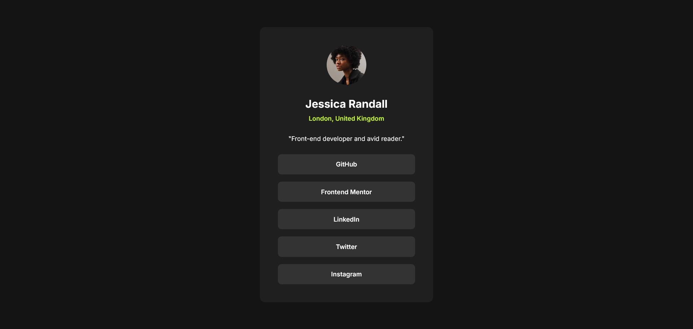

# Frontend Mentor - Social links profile solution

This is a solution to the [Social links profile challenge on Frontend Mentor](https://www.frontendmentor.io/challenges/social-links-profile-UG32l9m6dQ). Frontend Mentor challenges help you improve your coding skills by building realistic projects.

## Table of contents

- [Overview](#overview)
  - [The challenge](#the-challenge)
  - [Screenshot](#screenshot)
  - [Links](#links)
- [My process](#my-process)
  - [Built with](#built-with)
  - [What I learned](#what-i-learned)
  - [Continued development](#continued-development)

## Overview

### The challenge

Users should be able to:

- See hover and focus states for all interactive elements on the page

### Screenshot



### Links

- Solution URL: [Add solution URL here](https://github.com/SaiDineshKopparthi/Frontend-Mentor-Challanges/tree/main/social-links-profile)
- Live Site URL: [Add live site URL here](https://social-links-profile-dinesh.netlify.app/)

## My process

### Built with

- Semantic HTML5 markup
- CSS custom properties
- Flexbox
- CSS Grid
- Mobile-first workflow

### What I learned

#### Mastering Flexbox Properties

I've developed a deeper understanding of **CSS Flexbox** and, in particular, the following CSS snippet has become second nature to me:

```css
display: flex;
flex-direction: column;
justify-content: center;
align-items: center;
This approach has greatly simplified my workflow, making layout structuring much more efficient.
```

#### Improved Usage of clamp()

I have also gained more familiarity with the `clamp()` function and started utilizing it more effectively in responsive designs. This has helped me create layouts that adapt seamlessly to different screen sizes without relying heavily on media queries.

### Continued development

- I will be customizing the website to better suit my profile.
- I plan to experiment with new color palettes and explore different color combinations to enhance the overall design.